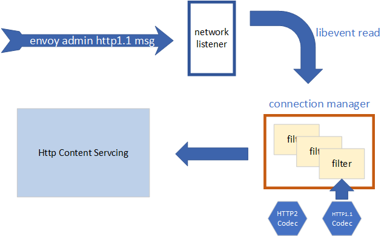

# Main Thread

*Envoy facilitates the software trend* of breaking monolithic application down into small pieces micro-services. But envoy itself is a monolithic application. Very similar to `enginx`,
in envoy, it has a main admin thread and several worker threads, listening on different network ports respectively.

Generally, the main thread is considered as the control plane (while envoy do support to pass control data stream throw listening port other than admin network socket also). The main thread is responsible for creating a administration server and the data plane worker threads.

The administration server interacts with envoy end users through the RESTful APIs, in the way of 'http://<ip>:<port>/hot_restart_version', this page is a general description of how it works, briefly. There are tons of details for the network data processing part, refer to *this* document.

## Http Server

In envoy, a listening network socket port is been considered as a `listener` on a network `connection`. Any socket read or write event will be captured with the assistant of 'libvent'.

As illustrated, the administration `listener` monitors the envoy control network port. Once a http data reached the port, it will be delivered to the network data `filter chain`, which is managed by `connection manager`, then the content of the request will be parsed by the libvent mechanism, and the later 'admin content server' will action as needed. There are
two http protocols supported in envoy, in a component called `codec`, which is HTTP protocol 1.1 and 2.0.

## Dispatcher based on libevent

## Assisting Logics
There are a lot modules that support the monitoring the main thread, including configuration, logging, status, re-starter, tracer modules.

## Key Technology

### [libevent](https://libevent.org/)
[TODO] Introduction and quick guide for writing a demo.

### socket programming
[TODO] to be added